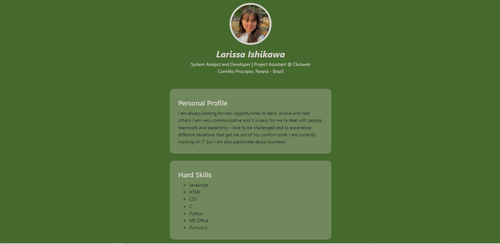
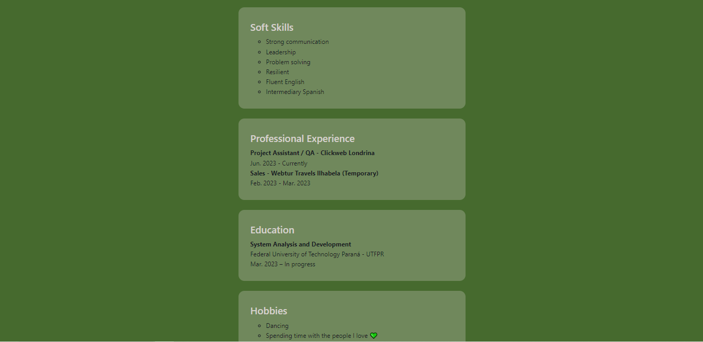

# LARISSA ISHIKAWA'S CURRICULUM VITAE

##### Project built based on a previous project (NLW 2022), for the Front-End course.

[Click here to access](https://larissaiishikawa.github.io/myCV//)

## Technologies and Tools
- HTML
- CSS
- Javascript
- Git & Github

### Do you have any feedbacks?
Please contact me! :D
- My [e-mail](mailto:l.ishikawa@cunha)
- My [linkedin](https://www.linkedin.com/in/larissaishikawacunha/)

###### Made with 💚 by [LARISSA ISHIKAWA](https://github.com/larissaiishikawa)
